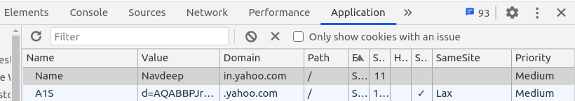
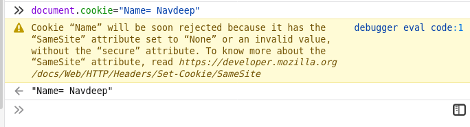

If you [understand how cookies on the web work](/cookie), you will be aware of how third party elements on a website, like ads and social media posts, are the means for big companies like google and facebook to track you.

Luckily, all popular browsers have brought updates regarding the `same-site` attribute. 

This attribute specifes which cookies will be attached to different types of request.
This attribute takes 3 parameters:

#### 1. Strict
If a cookie has `sameSite=strict` attribute, then that cookie will only be sent as a first party cookie. Meaning, if a cookie is built by _xyz.com_ then that cookie will only be passed into request headers if and only if the user is on _xyz.com_.
>*Note*: If a user visits _xyz.com_ after a top level redirect from another website (_probably by clicking on a link_) then also the cookies will not be passed; hence the term _sameSite=**strict**_

This is useful to avoid [Cross Site Request Forgery (CSRF)](https://www.youtube.com/watch?v=vRBihr41JTo)

#### 2. Lax
If a cookie has `sameSite=lax` attribute, then that cookie is sent on all visits to the page. This means that it is the same as `sameSite=strict` but this cookie will also be passed during a top level redirect from another site.

#### 3. None
This property means that cookies will be passed during all sorts of requests to the site. Whether it is a third-party request, redirects or direct navigaation to the site; this cookie is always sent with any request to the cookie domain.

## What are the new defaults?
Before the updates for implementing this attribute, browsers followed the behaviour of `sameSite=none`. This led to many security flaws in applications relying on [Cross Orign Resource Sharing](https://www.youtube.com/watch?v=Ka8vG5miErk&t=740s) (_Most common of which were CSRFs_).

After the introduction of `same-site`, all the browsers now have a default behaviour of `sameSite=lax`. But all of them, in their release, recommended to use the `sameSite=strict` property.

## Was the transition smooth?
The days following this update witnessed the crash of many websites. And aupdates in the feature starting from Chrome 80 and Firefox 60 were quite similar, there were(_and still are_) some small differences in the implementation across these two browsers.

#### Chrome
This is a minor detail, but chrome still allows us to create cookies using javascript's `document.cookie` object without any kinds of warning. 

After creating the cookie this way, if you check the application's stored cookies we see that it does not even specify the default `lax` property, that the browser uses, in the cookie description

#### Firefox
Firefox, on the other hand, had a cleaner implementation (_in my opinion_). It gave proper warnings, pointing the user at the [official documentation](https://developer.mozilla.org/en-US/docs/Web/HTTP/Headers/Set-Cookie/SameSite) for reference and also showed the default parameter that it used for `SameSite` in the cookie description

---
To understand the `sameSite` attribute better, do watch [this](https://www.youtube.com/watch?v=LjP-0d6-5Ew) video. It contains practical examples of different values of the property.

> *_In the end, the internet became a much safer place_*